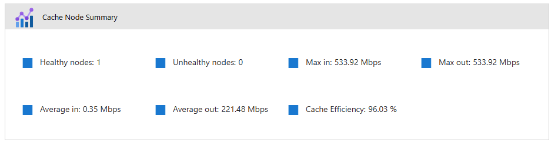
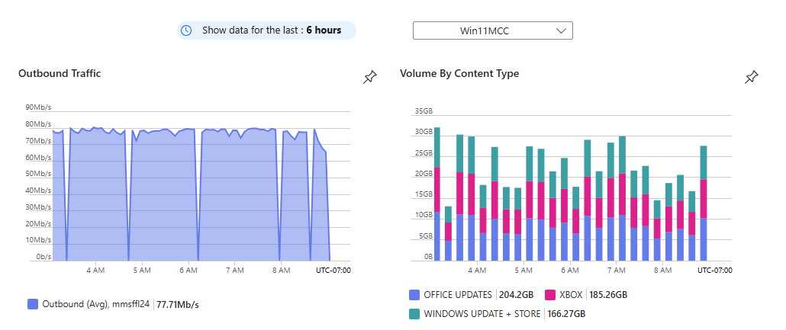
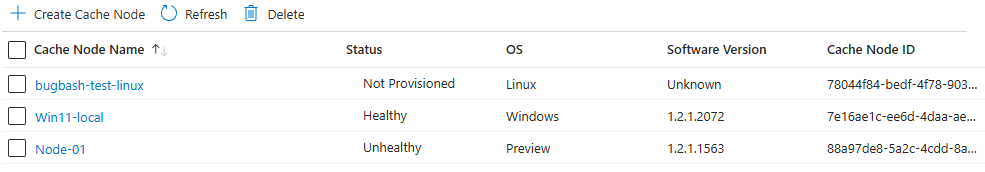

# Monitor cache node usage

Tracking the status and performance of your Connected Cache node is essential to making sure you're getting the most out of the service.

For basic monitoring, navigate to the **Overview** tab. Here you can view a collection of predefined metrics and charts. All the monitoring in this section will function right after your Connected Cache node has been deployed. You can view more details about each cache node by navigating to the **Cache Nodes** section under the **Cache Node Management** tab. This page displays cache node information such as Status, Host machine OS, Software Version, and Cache Node ID.

For advanced monitoring, navigate to the **Metrics** section under the **Monitoring** tab. Here you can access more sampled metrics (hits, misses, inbound traffic) and specify different aggregations (count, avg, min, max, sum). You can then use this data to create customized charts and configure alerts.

Using the two monitoring sections, you can gather essential insights into the health, performance, and efficiency of your Connected Cache nodes.

## Basic Monitoring

### Cache node summary

Below are the metrics found in the **Cache Node Summary** dashboard, along with their descriptions. This dashboard only reflects data received from cache nodes in the last 24 hours.



| Metric | Description |
| --- | --- |
| Healthy nodes | Your Connected Cache node will periodically send heartbeat messages to the Connected Cache service. If the Connected Cache service has received a heartbeat message from your Connected Cache node in the last 24 hours, the node is labeled as healthy. |
| Unhealthy nodes | If the Connected Cache service hasn't received a heartbeat message from your Connected Cache node in the last 24 hours, the node is labeled as unhealthy. |
| Max in | The maximum ingress in Megabits per second (Mbps) that your node has pulled from Content Delivery Network (CDN) endpoints in the last 24 hours. |
| Max out | The minimum egress in Mbps that your node has sent to Windows devices in its network over the last 24 hours. |
| Average in | The average ingress in Mbps that your node has pulled from CDN endpoints in the last 24 hours. |
| Average out | The average egress in Mbps that your node has sent to Windows devices in its network over the last 24 hours. |
| Cache efficiency | The percentage of all content requests your Connected Cache node receives that can be fulfilled using your node's cached content. A well-performing node should have an efficiency > 90%. |

### Key metric charts

The two predefined charts on the Overview page visually represent the egress and types of content served by your Connected Cache node. The filters that are displayed below the cache node summary dashboard only affect the data shown in the key metric charts.



#### Filters

There are two filter controls that can be used to configure the key metric charts.

- Timespan: Select how far back the chart should display
- Cache nodes: Select which Connected Cache nodes the chart should display data for

#### Outbound Traffic Chart

This chart displays the average egress in bits per second (b/s) that your selected Connected Cache nodes delivered over the specified timespan.

#### Volume by Content Type

This chart displays the volume of each supported content type in bytes (B) that your selected Connected Cache nodes delivered over the specified timespan. See [Microsoft Connected Cache content and services endpoints](delivery-optimization-endpoints.md) for a complete list of supported content types.

The content types displayed in the chart each have a distinct color and are sorted in descending order of volume. The bar chart is stacked such that you can visually compare total volume being delivered at different points in time.

### Cache node details

The **Cache Nodes** section under the **Cache Node Management** tab displays cache node information such as status, host machine OS, software version, and cache node ID.



| Metric | Description |
| --- | --- |
| Cache node name | The user-defined name of the cache node. |
| Status | The heartbeat status of the cache node. |
| OS | The host machine OS that this cache node is compatible with. |
| Software version | The version number of the cache node's Connected Cache container. |
| Cache node ID | The unique identifier of the cache node. |
| Migrated | Indicates whether the cache node has been migrated from the public preview to the generally available version of Microsoft Connected Cache. |

#### GA migration status

If you created cache nodes during public preview, the **Migrated** column helps you determine whether the cache nodes have been migrated to the generally available release of Connected Cache.

| Value | Description |
| --- | --- |
| Yes | The cache node was created and deployed _before_ GA launch, and you have completed the required steps to migrate it to the GA release. |
| No | The cache node was created and deployed _before_ GA launch, and you must follow the required steps to migrate it to the GA release. |
| N/A | The cache node was created and deployed _after_ GA launch and is already using the GA release. |

To migrate your cache nodes to the GA release, you must redeploy them using the [latest Linux-hosted deployment package](https://aka.ms/mcc-ent-linux-deploy-scripts) or the [latest Connected Cache Windows application](https://aka.ms/do-mcc-ent-windows-x64).

>[!NOTE]
> After redeploying a Linux cache node so that it's migrated to the GA release container, the user must run `chmod 777 -R /cachedrivepath` and then restart the Connected Cache container `sudo iotedge restart MCC`.
> Otherwise the redeployed node will be up and running, but requests for content will fail.

## Advanced Monitoring

### Customizable Azure portal charts

To expand upon the metrics shown in the Overview tab, navigate to the **Metrics** tab in the left side toolbar of Azure portal.

Listed below are the metrics you can access in this section:

| Metric | Description |
| --- | --- |
| Inbound | The number of content requests your Connected Cache node receives over a specified period of time. |
| Hits | The number of times your Connected Cache node fulfills a content request by pulling from its cache. |
| Misses | The number of times your Connected Cache node isn't able to fulfill a content request by pulling from its cache |

Once you select the charts you would like to track, you can save them to a personalized dashboard. You can configure the chart title, filters, range, legend, and more. You can also use this personalized dashboard to set up alerts that notify you if your Connected Cache node dips in performance.

Some example scenarios where you would want to set up a custom alert:

- My Connected Cache node is being shown as unhealthy and I want to know exactly when it stopped egressing last
- A new Microsoft Word update was released last night and I want to know if my Connected Cache node is helping deliver this content to my Windows devices

### Terse summary page

When your cache node is up and running, you can access a web-based summary page that provides a terse overview of the cache node's status and performance. This page is accessible at the following URL.

```HTML
https://localhost:5000/details?apiKey=[YourConnectedCacheCustomerId]__D0508632-1B4D-431C-9EF3-49285AF4DC1F
```

You'll need to replace `[YourConnectedCacheCustomerId]` with your Connected Cache customer ID, which can be found in the Azure portal under the **Cache Node Management** tab. By default, this page is only accessible from the host machine where the Connected Cache node is deployed.

To remotely access the terse summary page, you need to create a firewall rule to allow inbound traffic on port 5000. If the cache node is deployed to a Windows host machine, you also need to port forward the host machine's port 5000 to the Windows Subsystem for Linux (WSL) distribution. For more information, see [Missing WSL port forwarding rules (443, 5000)](mcc-ent-troubleshooting.md#missing-wsl-port-forwarding-rules-443-5000).

## Client device metrics

Your Connected Cache node can keep track of how much content has been sent to requesting Windows devices, but the node can't track whether the content was successfully received by the device. For more information on accessing client-side data from your Windows devices, see [Monitor Delivery Optimization](waas-delivery-optimization-monitor.md).
