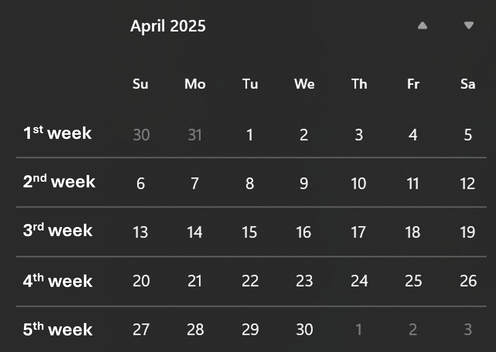

# Configure container update frequency for Microsoft Connected Cache for Enterprise and Education

Microsoft Connected Cache for Enterprise and Education caching software is deployed to host machines as a container. The container OS and any software component within the container need to be updated to address security vulnerabilities and improve quality and performance. These Microsoft-published container updates are referred to as "Connected Cache updates" in this article.

Microsoft silently deploys Connected Cache updates to your cache nodes based on the **Update Ring** setting you configure for each cache node.

## Update rings

Connected Cache nodes can be configured to either the `Fast` or `Slow` update ring. If configured to update as part of the Fast ring, the cache node will be silently updated by Microsoft soon after the update is made available. If configured to update as part of the `Slow` ring, the cache node is silently updated by Microsoft within five weeks of the update becoming available.

In other words, configuring cache nodes to update as part of the `Slow` ring provides users with the option to delay the update process until they have validated that the latest Connected Cache update works within their environment. For example, a user could configure a test cache node to update as part of the `Fast` ring and validate that clients can successfully interact with the test cache node after the latest Connected Cache update has been applied. This builds confidence that service won't be interrupted when the production cache nodes are updated as part of the `Slow` ring.

### Update ring options

>[!IMPORTANT]
> In the event of a critical security patch, Microsoft may elect to initiate a Connected Cache update to your cache node as soon as possible (even if the cache node has been set to the `Slow` Ring). Visit the [Release notes](mcc-ent-release-notes.md) page for a detailed changelog of each Connected Cache update.

#### Fast Ring

All Connected Cache nodes are configured to update as part of the `Fast` ring by default. Connected Cache nodes in the `Fast` ring will be updated soon after an update is made available. The update will silently update cache nodes at a time of day when update traffic is likely to be minimal, such as 3:00 AM (local time) on Saturday.

#### Slow Ring

Configuring a Connected Cache node to update as part of the `Slow` ring provides users with the option to delay Connected Cache software updates until the update can be validated. There are three settings that control when Connected Cache updates will be applied to Connected Cache nodes. All update ring settings can be managed from the Azure portal or through the Azure CLI.

| Setting | Description |
| --- | --- |
| Week of the month | 2nd or 3rd week can be selected. Reference the example calendar below for how weeks are counted. |
| Day of the week | Monday through Sunday can be selected. |
| Time of day | Time of day is based on UTC and a 24 hour clock. |

## Updating Connected Cache Linux Components

As part of the Connected Cache installation process, there are several packages and kernel-level configurations that are installed and configured within the Connected Cache Linux environment to optimize delivery. If Connected Cache is deployed to a Linux host machine, these packages and configurations are made to the host machine itself. If Connected Cache is deployed to a Windows host machine, these packages and configurations are made to the Windows Subsystem for Linux (WSL) distribution.

These packages and kernel-level configuration may need to be updated for several reasons, such as security and compatibility. Note that while Connected Cache uses Azure IoT Edge as its container orchestration layer, this guidance is focused on the host-level implications and configurations.

### Package Version Updates

The following packages are updated as part of Connected Cache lifecycle operations.

#### Azure IoT Edge and Identity Service Versions

Microsoft Connected Cache is deployed as an Azure IoT Edge module today and the IoT Edge runtime and associated identity services are updated to ensure compatibility with Microsoft Connected Cache container images.

##### Docker Server and Client Versions

Azure IoT Edge uses Moby-based Docker components (`moby-engine`, `moby-cli`) for container management. These are updated to maintain compatibility with the Azure IoT Edge infrastructure.

### Kernel Network Configuration

The Microsoft Connected Cache installation modifies kernel-level configurations for performance tuning and updates to these configurations may be required to ensure efficient, performant delivery of content to your network.

The following kernel parameters are commonly tuned on Connected Cache Linux hosts to optimize network performance and container behavior:

* net.ipv4.tcp_congestion_control
* net.core.default_qdisc
* net.core.somaxconn
* net.ipv4.ip_local_port_range
* net.ipv4.tcp_rmem
* net.ipv4.tcp_wmem
* net.ipv4.tcp_mem
* net.netfilter.nf_conntrack_max
* net.nf_conntrack_max
* net.core.optmem_max

#### Cleanup of Old Docker Images

The update process includes cleanup of outdated or unused Docker images, including:

* edgeAgent
* edgeHub
* mcc

This ensures disk space is reclaimed and only current versions are retained.

## Update process

When Microsoft publishes a Connected Cache update, the Connected Cache service attempts to update all Connected Cache nodes based on their **Update Ring** membership. If a cache node can't complete the silent Connected Cache update within 6 hours of starting, an error message is surfaced in the Azure portal.

## Update terminology, criteria, and information

Connected Cache updates are released based on need instead of on a set cadence.

| Update type | Criteria and information |
| --- | --- |
| Security | Security updates are the highest priority and are released based on the severity rating of the vulnerability. Updates for [Critical and High](https://nvd.nist.gov/vuln-metrics/cvss) vulnerabilities are released by Microsoft within 60 days of discovery. Updates for [Medium and Low](https://nvd.nist.gov/vuln-metrics/cvss) vulnerabilities are released by Microsoft within 120 days. |
| Quality | Quality updates fix a specific problem and addresses a noncritical, non-security-related bug. Quality updates could include performance fixes for a specific problem or changes related to cache efficiency or maximum egress for example. Quality updates are released along with security updates or when necessary to ensure proper functioning of the Microsoft Connected Cache software. |

For information on all released Microsoft Connected Cache updates, see the [Connected Cache release notes](mcc-ent-release-notes.md).
